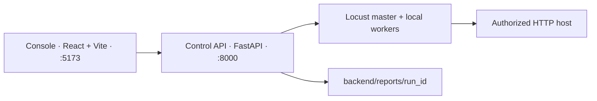
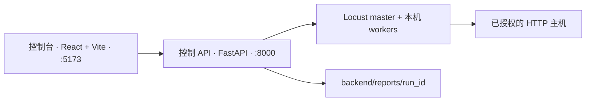

# PressureTest

A local control plane for [Locust](https://locust.io/). Pick a scenario, bound the run, and watch throughput, latency, and failures from one console.

本机上的 Locust 压测控制台。选定场景、设好上限，在同一个界面里看吞吐、延迟和失败。

[English](#english) · [简体中文](#简体中文)

> Load-test only systems you own or are explicitly authorized to test. The host allowlist and the caps below are there to keep a run inside that boundary.
>
> 只对自有或已获授权的系统发起压测。主机白名单和下列上限用来把一次运行关在这个边界里。

---

## English

PressureTest is a small orchestration layer around Locust. A FastAPI process owns the run lifecycle. A React console is the only interface you need for day-to-day work. Locust itself stays a subprocess: one master and up to a configured number of local workers.

The console can discover candidate paths, start and stop a run, stream live stats, and write a report on disk. Runs are single-machine. There is no remote worker fleet in this repository.

### Architecture



| Piece | Role |
|---|---|
| `frontend/` | Console: scenario, load shape, live charts, history |
| `backend/app/` | Control API, guardrails, scenario registry, Locust supervisor |
| `backend/app/scenarios/` | One module per target. Register it and the console picks it up |
| `backend/reports/` | Per-run artifacts. Git ignores everything here except `.gitkeep` |

### Requirements

- macOS or Linux, with `bash`
- [Miniconda](https://docs.conda.io/en/latest/miniconda.html) or Anaconda
- Node.js 22 and npm
- Git

Docker Compose is optional. It is a packaged way to boot the same two processes. Day-to-day development uses the conda environment `pressure-test`, defined in [`environment.yml`](environment.yml): Python 3.12 plus the backend dependencies.

### Quick start

From the repository root:

```bash
chmod +x scripts/setup_conda.sh scripts/start.sh
./scripts/start.sh
```

The script creates `pressure-test` on first run, installs the backend in that environment, installs frontend dependencies, and starts both processes. Leave the terminal open.

| Surface | URL |
|---|---|
| Console | http://127.0.0.1:5173 |
| OpenAPI | http://127.0.0.1:8000/docs |
| Health | http://127.0.0.1:8000/api/health |

`Ctrl+C` stops the backend and the frontend.

A short smoke run is enough to confirm the path: 3 users, spawn rate 1, duration `20s`, against a host you are allowed to test.

### Start the processes yourself

Use this when you want reload logs in separate terminals.

```bash
./scripts/setup_conda.sh
conda activate pressure-test
export PYTHONNOUSERSITE=1
```

`PYTHONNOUSERSITE=1` keeps packages from `~/.local` out of this environment.

Backend:

```bash
cd backend
export PYTHONPATH="$(pwd)"
uvicorn app.main:app --host 127.0.0.1 --port 8000 --reload
```

Frontend, in a second terminal:

```bash
cd frontend
npm install
npm run dev -- --host 127.0.0.1 --port 5173
```

To refresh the conda environment after `environment.yml` changes, run `./scripts/setup_conda.sh` again. It updates `pressure-test` in place.

### Docker Compose

```bash
docker compose up --build
```

The compose file publishes `8000` and `5173`, mounts `backend/app` and `frontend/src` for local edits, and writes reports to `backend/reports/` on the host. The API container must be able to reach the target host.

### Using the console

1. Choose a scenario. The host field follows that scenario's hint. You can override the host. The API rejects hostnames outside `PT_ALLOWED_HOSTS`.
2. Discover paths from a start page, or type paths yourself. Each path is a GET target for the generated Locust user.
3. Pick a load shape.
   - **Users.** Virtual users with think time between requests. Set users and spawn rate.
   - **Throughput.** A target aggregate requests-per-second. Set `target_rps`.
4. Set duration (`60s`, `5m`, `1h`) and the number of local Locust workers.
5. Start the run. The console streams RPS, latency percentiles, failure rate, per-endpoint stats, and host CPU and memory.
6. Stop early from the console, or let the duration elapse. The run remains in the history list. A Word report can be downloaded from that run. The same files land in `backend/reports/<run_id>/`.

Those report directories stay on the machine that ran the test. They are not part of the git tree.

### Built-in scenarios

| ID | Name | Default host |
|---|---|---|
| `bjtu_130th` | 北京交大 130 周年站 | `https://130th.bjtu.edu.cn` |
| `bjtu_welcome` | 北京交大迎新网 | `https://welcome.bjtu.edu.cn` |
| `bjtu_map` | 北京交大校园地图 | `https://map.bjtu.edu.cn` |
| `example_generic` | 通用 HTTP 路径压测（示例） | `https://example.com` |

`example_generic` is the template for a new target. The three BJTU scenarios are ordinary HTTP GET workloads against public site paths. Add the hostname to the allowlist before you point a run at anything else.

### Add a scenario

1. Copy [`backend/app/scenarios/example_generic.py`](backend/app/scenarios/example_generic.py).
2. Set `ScenarioMeta`: `id`, `name`, `description`, `host_hint`, `default_paths`.
3. Register the module in [`backend/app/scenarios/registry.py`](backend/app/scenarios/registry.py).
4. Add the hostname to `PT_ALLOWED_HOSTS`.
5. Restart the API. The scenario shows up in the console dropdown.

A scenario may replace `build_user_class` with its own Locust `HttpUser`, including `@task` and `SequentialTaskSet`, when the workload is a login, a form, or a fixed call sequence. The control API does not need to change.

### Guardrails

Every limit is an environment variable with the prefix `PT_`. The API reads them at process start. Defaults live in [`backend/app/config.py`](backend/app/config.py).

| Variable | Default | Meaning |
|---|---|---|
| `PT_ALLOWED_HOSTS` | `130th.bjtu.edu.cn,welcome.bjtu.edu.cn,map.bjtu.edu.cn,localhost,127.0.0.1` | Hostnames a run may target |
| `PT_MAX_USERS` | `50000` | Concurrent users |
| `PT_MAX_SPAWN_RATE` | `500` | Users spawned per second |
| `PT_MAX_DURATION_SECONDS` | `7200` | Run length, 120 minutes |
| `PT_MAX_WORKERS` | `8` | Local Locust worker processes |
| `PT_MAX_TARGET_RPS` | `100000` | Aggregate RPS in throughput mode |
| `PT_CORS_ORIGINS` | `http://localhost:5173,http://127.0.0.1:5173` | Browser origins allowed to call the API |
| `PT_REPORTS_DIR` | `backend/reports` | Where run artifacts are written |

`./scripts/start.sh` exports `PT_ALLOWED_HOSTS` and `PT_CORS_ORIGINS` when they are unset, then starts the API. Export your own values before the script if the defaults are wrong for your target.

### HTTP API

Interactive docs: http://127.0.0.1:8000/docs

| Method | Path | Purpose |
|---|---|---|
| `GET` | `/api/health` | Liveness |
| `GET` | `/api/scenarios` | Registered scenarios |
| `GET` | `/api/guardrails` | Effective caps and allowlist |
| `POST` | `/api/discover-paths` | Probe a start page for candidate paths |
| `GET` | `/api/runs` | Run history |
| `POST` | `/api/runs` | Create and start a run |
| `GET` | `/api/runs/{id}` | Run detail |
| `POST` | `/api/runs/{id}/stop` | Stop a run |
| `GET` | `/api/runs/{id}/events` | Server-sent events for that run |
| `GET` | `/api/runs/{id}/report.docx` | Word report |
| `GET` | `/api/system/metrics` | Host and Locust process metrics |
| `GET` | `/api/system/events` | Server-sent events for system metrics |

The run resource is the stable contract. A later runner can replace the local subprocess supervisor and leave the console in place.

### Layout

```text
PressureTest/
  environment.yml          conda env pressure-test
  docker-compose.yml
  scripts/setup_conda.sh   create or update the env
  scripts/start.sh         env, install, both processes
  backend/app/             FastAPI, scenarios, Locust supervisor
  backend/reports/         local run output, not committed
  frontend/src/            console
```

---

## 简体中文

PressureTest 是包在 Locust 外面的一层编排。FastAPI 进程负责一次运行的生命周期，React 控制台是日常唯一需要打开的界面。Locust 本身是子进程：一个 master，再加上配置允许的若干本机 worker。

控制台可以探测候选路径、启停运行、推送实时统计，并把报告写到磁盘。运行发生在启动它的那一台机器上。这个仓库里没有远程 worker 集群。

### 架构



| 部分 | 职责 |
|---|---|
| `frontend/` | 控制台：场景、负载形状、实时曲线、历史 |
| `backend/app/` | 控制 API、护栏、场景注册表、Locust 进程管理 |
| `backend/app/scenarios/` | 每个目标一个模块。注册之后控制台即可选用 |
| `backend/reports/` | 每次运行的产物。除 `.gitkeep` 外不进入 Git |

### 环境要求

- macOS 或 Linux，并且可用 `bash`
- [Miniconda](https://docs.conda.io/en/latest/miniconda.html) 或 Anaconda
- Node.js 22 与 npm
- Git

Docker Compose 可选，用来把同样的两个进程打包拉起。日常开发使用 conda 环境 `pressure-test`，定义在 [`environment.yml`](environment.yml)：Python 3.12，以及后端依赖。

### 快速启动

在仓库根目录：

```bash
chmod +x scripts/setup_conda.sh scripts/start.sh
./scripts/start.sh
```

脚本会在第一次运行时创建 `pressure-test`，在该环境中安装后端，安装前端依赖，然后同时启动两个进程。终端保持打开。

| 入口 | 地址 |
|---|---|
| 控制台 | http://127.0.0.1:5173 |
| OpenAPI | http://127.0.0.1:8000/docs |
| 健康检查 | http://127.0.0.1:8000/api/health |

`Ctrl+C` 会同时停掉后端和前端。

确认链路时用一次小流量即可：3 个用户、爬坡速率 1、时长 `20s`，目标必须是你有权测试的主机。

### 分开启动

需要在两个终端里看重载日志时用这一路。

```bash
./scripts/setup_conda.sh
conda activate pressure-test
export PYTHONNOUSERSITE=1
```

`PYTHONNOUSERSITE=1` 用来避免 `~/.local` 里的包混进这个环境。

后端：

```bash
cd backend
export PYTHONPATH="$(pwd)"
uvicorn app.main:app --host 127.0.0.1 --port 8000 --reload
```

前端，另开一个终端：

```bash
cd frontend
npm install
npm run dev -- --host 127.0.0.1 --port 5173
```

`environment.yml` 变更之后，再执行一次 `./scripts/setup_conda.sh`。它会就地更新 `pressure-test`。

### Docker Compose

```bash
docker compose up --build
```

Compose 文件会映射 `8000` 和 `5173`，挂载 `backend/app` 与 `frontend/src` 以便本地修改，并把报告写到宿主机的 `backend/reports/`。API 容器需要能够访问被测主机。

### 控制台用法

1. 选择场景。主机栏会带上该场景的默认地址，也可以改。API 会拒绝 `PT_ALLOWED_HOSTS` 之外的主机名。
2. 从起始页探测路径，或自己填写。这些路径会成为生成出来的 Locust 用户的 GET 目标。
3. 选择负载形状。
   - **用户数。** 虚拟用户在请求之间带思考时间。设置用户数和爬坡速率。
   - **吞吐。** 设定总请求速率。填写 `target_rps`。
4. 设置时长（`60s`、`5m`、`1h`）和本机 Locust worker 数量。
5. 开始运行。控制台会推送 RPS、延迟分位、失败率、各接口统计，以及主机 CPU 和内存。
6. 可以在控制台提前停止，也可以等到时长结束。记录留在历史列表里，可以从该次运行下载 Word 报告。同一批文件落在 `backend/reports/<run_id>/`。

这些报告目录留在执行压测的机器上，不进入 Git。

### 内置场景

| ID | 名称 | 默认主机 |
|---|---|---|
| `bjtu_130th` | 北京交大 130 周年站 | `https://130th.bjtu.edu.cn` |
| `bjtu_welcome` | 北京交大迎新网 | `https://welcome.bjtu.edu.cn` |
| `bjtu_map` | 北京交大校园地图 | `https://map.bjtu.edu.cn` |
| `example_generic` | 通用 HTTP 路径压测（示例） | `https://example.com` |

`example_generic` 是新增目标时的模板。三个交大场景是对公开站点路径的普通 HTTP GET。把运行指向其他主机之前，先把主机名加进白名单。

### 新增场景

1. 复制 [`backend/app/scenarios/example_generic.py`](backend/app/scenarios/example_generic.py)。
2. 填写 `ScenarioMeta`：`id`、`name`、`description`、`host_hint`、`default_paths`。
3. 在 [`backend/app/scenarios/registry.py`](backend/app/scenarios/registry.py) 注册该模块。
4. 把主机名加入 `PT_ALLOWED_HOSTS`。
5. 重启 API。场景会出现在控制台下拉列表中。

负载若是登录、表单或固定调用序列，可以在场景里用自己的 Locust `HttpUser` 替换 `build_user_class`，包括 `@task` 和 `SequentialTaskSet`。控制 API 不用改。

### 护栏

所有上限都是带 `PT_` 前缀的环境变量。API 在进程启动时读取。默认值在 [`backend/app/config.py`](backend/app/config.py)。

| 变量 | 默认值 | 含义 |
|---|---|---|
| `PT_ALLOWED_HOSTS` | `130th.bjtu.edu.cn,welcome.bjtu.edu.cn,map.bjtu.edu.cn,localhost,127.0.0.1` | 允许压测的主机名 |
| `PT_MAX_USERS` | `50000` | 并发用户数 |
| `PT_MAX_SPAWN_RATE` | `500` | 每秒爬坡用户数 |
| `PT_MAX_DURATION_SECONDS` | `7200` | 单次最长 120 分钟 |
| `PT_MAX_WORKERS` | `8` | 本机 Locust worker 进程数 |
| `PT_MAX_TARGET_RPS` | `100000` | 吞吐模式下的总 RPS |
| `PT_CORS_ORIGINS` | `http://localhost:5173,http://127.0.0.1:5173` | 允许调用 API 的浏览器来源 |
| `PT_REPORTS_DIR` | `backend/reports` | 运行产物目录 |

`./scripts/start.sh` 在这两个变量未设置时会导出 `PT_ALLOWED_HOSTS` 和 `PT_CORS_ORIGINS`，然后启动 API。默认值不适合你的目标时，先导出自己的值再运行脚本。

### HTTP API

交互文档：http://127.0.0.1:8000/docs

| 方法 | 路径 | 作用 |
|---|---|---|
| `GET` | `/api/health` | 存活检查 |
| `GET` | `/api/scenarios` | 已注册场景 |
| `GET` | `/api/guardrails` | 当前上限与白名单 |
| `POST` | `/api/discover-paths` | 从起始页探测候选路径 |
| `GET` | `/api/runs` | 历史运行 |
| `POST` | `/api/runs` | 创建并启动一次运行 |
| `GET` | `/api/runs/{id}` | 运行详情 |
| `POST` | `/api/runs/{id}/stop` | 停止运行 |
| `GET` | `/api/runs/{id}/events` | 该次运行的 SSE |
| `GET` | `/api/runs/{id}/report.docx` | Word 报告 |
| `GET` | `/api/system/metrics` | 主机与 Locust 进程指标 |
| `GET` | `/api/system/events` | 系统指标的 SSE |

run 资源是稳定契约。以后若换成别的执行器，控制台可以保持不变。

### 目录

```text
PressureTest/
  environment.yml          conda 环境 pressure-test
  docker-compose.yml
  scripts/setup_conda.sh   创建或更新环境
  scripts/start.sh         准备环境并启动前后端
  backend/app/             FastAPI、场景、Locust 进程管理
  backend/reports/         本机运行产物，不提交
  frontend/src/            控制台
```
